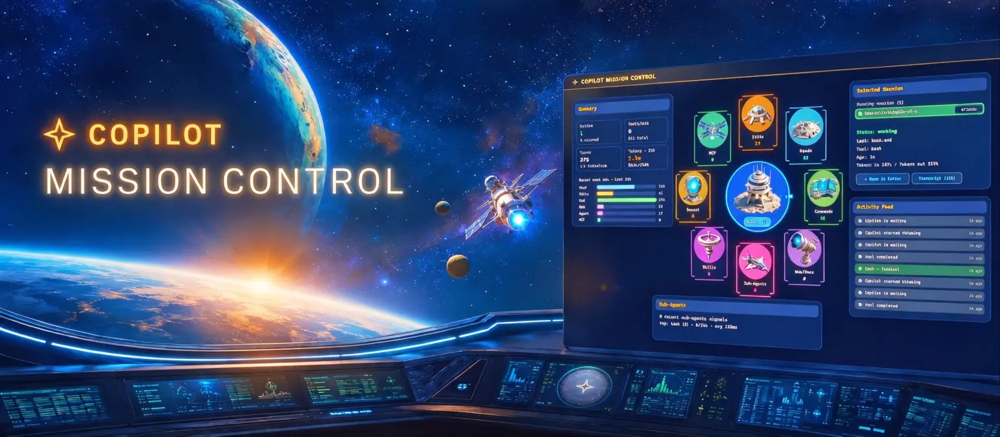

# 🛰️ Copilot Mission Control

A live dashboard that provides insights into the activity of [GitHub Copilot CLI](https://github.com/github/copilot-cli). Tool calls, hook callbacks, sub-agent dispatches, skills, edits, reads and more become live signals so you can spot stalls, follow active work, and catch actionable provider issues without scrolling back through terminal output.

Built with [Tauri 2](https://v2.tauri.app/), [Phaser 4](https://phaser.io/), and TypeScript.

🔗 Website: [https://danwahlin.github.io/copilot-mission-control](https://danwahlin.github.io/copilot-mission-control)


## What it does

Copilot Mission Control reads the local session state Copilot CLI already writes under `~/.copilot/session-state/` and tracks:

| Signal | What it tracks |
|---------------|----------------|
| Edits | File write/edit tools, including `apply_patch` |
| Reads | Reads, search, `view`, `rg` (ripgrep), and `glob` |
| Commands | Shell, SQL, test, and terminal-style commands |
| Web/Docs | Web fetches, docs lookups, and GitHub lookups |
| Hooks | Configured Copilot CLI hook callbacks |
| Sub-Agents | Sub-agent and `task` calls |
| Skills | `skill` and memory calls |
| Intent | Ask/intent/plan/schedule calls and fallback alerts |
| MCP | MCP server tool calls |
| Tokens | Input/output token totals from Copilot usage summaries |
| History | Global History analytics across all scanned sessions |

The dashboard panels show the selected session, recent activity, selected sector, replay controls, and an animated mission map. Open the session or sector inspector to filter recent calls by MCP, hooks, skills, sub-agents, or failures, then switch to the turn story to see what happened turn-by-turn. The Attention Center stays quiet for ordinary failed tool or hook completions and only surfaces actionable operational items such as provider scan problems or schema drift.

The topbar History route summarizes observed activity across all scanned sessions with 24-hour and local-day 7-day charts, model mix, event mix, top tools, token totals, recent sessions, and sanitized failure history. Sessions restarted with Copilot CLI `--continue` appear as a new local session record while carrying Copilot's resume metadata.

The normal activity bridge only sends sanitized summaries. Prompts, raw tool arguments, command output, file paths, and diffs are excluded from the live payload. History uses the same allowlisted scan summaries, and the inspector has an explicit local-only reveal action for retained raw tool details. Everything runs 100% locally on your machine.

### Focus mode

Click the 👁 button in the top-right to hide the side panels and put the mission map front-and-center. Great for a second monitor.

## Install

Builds for macOS, Windows, and Linux are produced from the [latest GitHub Release](https://github.com/DanWahlin/copilot-mission-control/releases). The app is not code-signed; see the release notes for platform-specific quarantine/SmartScreen unlock instructions.

## Develop

```bash
npm install
npm start            # builds frontend + launches Tauri dev window
```

Useful commands:

```bash
npm run build:frontend   # tsc + copy HTML/Phaser/assets to dist/
npm run build            # frontend + cargo build
npm test                 # build:frontend + playwright
npx playwright test      # tests only (build:frontend must run first)
cd src-tauri && cargo check
```

The frontend mounts at `dist/index.html` and Playwright serves it via `python3 -m http.server 4173 --directory dist`. Phaser runs inside the Tauri webview but is fully testable in plain Chromium because the `__missionControlFixture` global lets tests inject deterministic activity data.

## Architecture (brief)

- **`src-tauri/src/agent.rs`**: `AgentProvider` trait + `CopilotProvider` impl. Scans `~/.copilot/session-state/`, normalizes events through the bundled provider schema, caches the merged activity summary, and watches the directory with `notify = 8` so the UI updates within ~300 ms of changes. Returns only allowlisted fields.
- **`src-tauri/src/lib.rs`**: Tauri commands (`get_agent_activity`, legacy `get_copilot_activity`, raw-detail reveal, editor/URL openers, app version, hide/quit) plus tray and single-instance wiring. Uses `tauri-plugin-window-state` to persist window position across launches.
- **`src/scenes/MissionControl.ts`**: the single Phaser scene. Renders the mission map, nine sectors, pulse/arrival effects, ops status, responsive layout, and the space sprite atlas in `assets/space/`.
- **`src/main.ts`**: minimal Phaser bootstrap. One scene, opaque background, resizes with the window.
- **`src/index.html` + `hud.js`**: slim 32 px top bar, route controls, global History analytics, reset/panels/theme controls, dashboard panels, replay controls, inspector dialog, Attention Center, and schema-drift dialog.

## Assets

Sprites are drawn from a curated combined atlas under `assets/space/` (see `atlas.png` + `atlas.json`). Source spritesheets live under `assets/space/source/` for reference.

## Releasing

```bash
npm run release 0.2.0
```

`scripts/release.js` bumps `package.json`, `src-tauri/tauri.conf.json`, and `src-tauri/Cargo.toml`, regenerates `CHANGELOG.md` via `git-cliff`, commits, tags `v0.2.0`, and pushes. The `Build & Release` workflow then builds installers for all three platforms and attaches them to the GitHub Release.

## License

MIT [`LICENSE`](./LICENSE).
