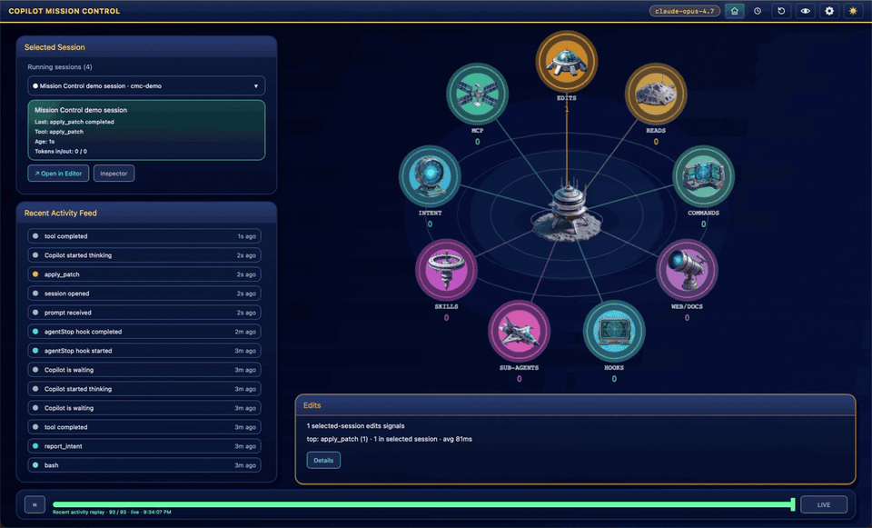
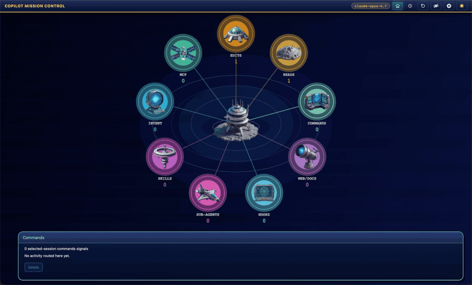

# 🛰️ Copilot Mission Control

A live, second-monitor dashboard for the [GitHub Copilot CLI](https://github.com/github/copilot-cli). Every tool call, sub-agent dispatch, and permission prompt becomes a live signal so you can spot stalls and "needs attention" the moment they happen — without scrolling back through terminal output.

Built with [Tauri 2](https://v2.tauri.app/), [Phaser 4](https://phaser.io/), and TypeScript.

🔗 Website: [https://danwahlin.github.io/copilot-mission-control](https://danwahlin.github.io/copilot-mission-control)



## What it does

Copilot Mission Control reads the local session state Copilot CLI already writes under `~/.copilot/session-state/` and groups every tool call into one of eight categories:

| Category | What it tracks |
|----------|----------------|
| **Forge** (Edits) | File writes / `apply_patch` calls |
| **Library** (Reads) | Reads / search / `view` calls |
| **Terminal Keep** (Commands) | Shell commands / `bash` calls |
| **Signal Tower** (Web/Docs) | Web fetches / external lookups |
| **Guild Hall** (Sub-Agents) | Sub-agent (`task`) calls |
| **Tome Hall** (Skills) | Skill (`skill`) calls |
| **Envoy House** (MCP) | MCP tool calls |
| **Royal Court** (Intent) | Permission prompts and alerts |

The dashboard panels on the left and right give you a live summary, the running session, and recent activity. A replay scrubber across the bottom lets you rewind the event timeline. Open the selected-session inspector to filter recent calls by MCP, skills, sub-agents, or failures, then switch to the turn story to see what happened turn-by-turn.

Only sanitized session summaries cross the renderer bridge — prompts, raw tool arguments, command output, file paths, and diffs **never** leave the Rust backend.

### Focus mode

Click the 👁 button in the top-right to hide the side panels and put the mission map front-and-center. Great for a second monitor.



## Install

Builds for macOS, Windows, and Linux are produced from the [latest GitHub Release](https://github.com/DanWahlin/copilot-mission-control/releases). The app is not code-signed; see the release notes for platform-specific quarantine/SmartScreen unlock instructions.

## Develop

```bash
npm install
npm start            # builds frontend + launches Tauri dev window
```

Useful commands:

```bash
npm run build:frontend   # tsc + copy HTML/Phaser/assets to dist/
npm run build            # frontend + cargo build
npm test                 # build:frontend + playwright
npx playwright test      # tests only (build:frontend must run first)
cd src-tauri && cargo check
```

The frontend mounts at `dist/game/index.html` and Playwright serves it via `python3 -m http.server 4173 --directory dist`. Phaser runs inside the Tauri webview but is fully testable in plain Chromium because the `__missionControlFixture` global lets tests inject deterministic activity data.

## Architecture (brief)

- **`src-tauri/src/agent.rs`** — `AgentProvider` trait + `CopilotProvider` impl. Scans `~/.copilot/session-state/`, normalizes events, and watches the directory with `notify = 8` so the UI updates within ~300 ms of any change. Returns only allowlisted fields.
- **`src-tauri/src/lib.rs`** — Tauri commands (`get_agent_activity`, `open_in_editor`, etc.) and the tray icon. Uses `tauri-plugin-window-state` to persist window size/position across launches.
- **`src/game/scenes/MissionControl.ts`** — the single Phaser scene. Renders the mission map, ops panel, replay timeline, session inspector, and the space sprite atlas in `assets/space/`.
- **`src/game/game.ts`** — minimal Phaser bootstrap. One scene, opaque background, resizes with the window.
- **`src/game/index.html` + `hud.js`** — slim 32 px top bar with brand, panels toggle, and theme toggle.

## Assets

Sprites are drawn from a curated combined atlas under `assets/space/` (see `atlas.png` + `atlas.json`). Source spritesheets live under `assets/space/source/` for reference.

## Releasing

```bash
npm run release 0.2.0
```

`scripts/release.js` bumps `package.json`, `src-tauri/tauri.conf.json`, and `src-tauri/Cargo.toml`, regenerates `CHANGELOG.md` via `git-cliff`, commits, tags `v0.2.0`, and pushes. The `Build & Release` workflow then builds installers for all three platforms and attaches them to the GitHub Release.

## Regenerating the README previews

The README and the GitHub Pages site share the two animated GIFs in `docs/img/`. To regenerate them after a UI change:

```bash
npm run build:frontend
(cd dist && python3 -m http.server 4173) &
node scripts/snap-readme-gifs.mjs
kill %1
```

Outputs `docs/img/dashboard.gif`, `docs/img/focus-mode.gif`, and a `docs/img/dashboard.png` still frame for the social `og:image` fallback. Requires `ffmpeg` on PATH.

## License

MIT [`LICENSE`](./LICENSE).
